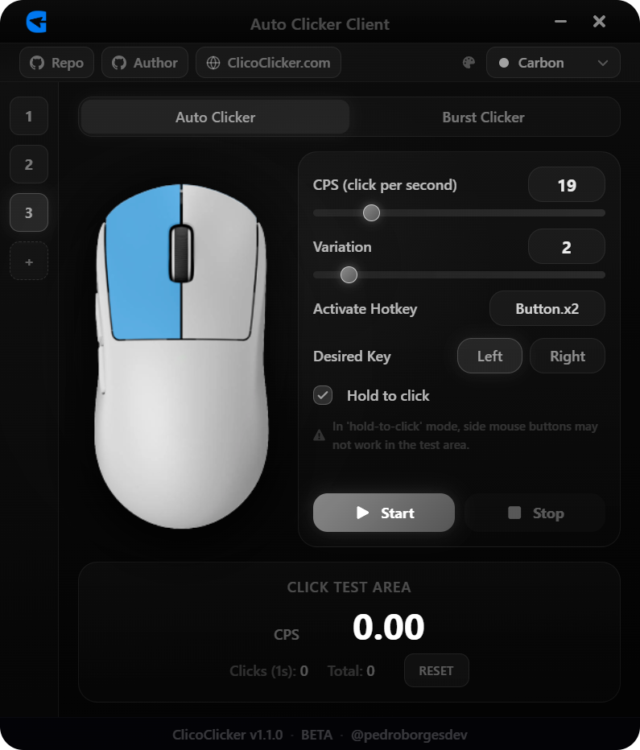

# ClicoClicker - Auto Clicker Client

<p align="center">
  
</p>

<p align="center">
  <strong>A powerful and modern auto clicker client built with Electron, React, TypeScript and Python.</strong>
</p>

<p align="center">
  Visit our official website at <a href="https://clicoclicker.com">clicoclicker.com</a> for downloads and more information.
</p>

## Table of Contents
- [About](#about)
- [Features](#features)
- [Architecture](#architecture)
- [Installation](#installation)
- [Building](#building)
- [Usage](#usage)
- [Scripts](#scripts)
- [Contributing](#contributing)
- [License](#license)
- [Author](#author)
- [Notes](#notes)

##

<div style="display: flex; align-items: center; gap: 32px; margin: 32px 0;">
  
  <div>
    <h3>What is ClicoClicker?</h3>
    <p>
      A modern and intuitive auto clicker that allows you to:
    </p>
    <ul>
      <li>Automate clicks with millisecond precision</li>
      <li>Configure CPS (clicks per second) with natural variation</li>
      <li>Activate/deactivate with custom hotkeys</li>
      <li>Choose between left or right mouse button</li>
      <li>Hold-to-click mode for better control</li>
      <li>Test click speed in real-time</li>
    </ul>
    <p>
      Perfect for gaming, software testing, or automating repetitive tasks.
    </p>
  </div>
</div>

## About

ClicoClicker is an open-source desktop application for mouse click automation, ideal for gaming, software testing, or repetitive tasks. It offers an intuitive and modern interface with advanced settings and optimized performance.

- Interface built with **React** + **TypeScript**
- Packaged as desktop application via **Electron**
- Click automation logic in **Python** subprocess (compiled with Nuitka for maximum performance)
- Dark theme, responsive and modern design

## Features

- **CPS Configuration:** Set the amount of clicks per second and variation
- **Mouse Button:** Choose between left or right click
- **Custom Hotkey:** Enable/disable auto clicker with any key or mouse button
- **Hold-to-Click Mode:** Click only while the key is pressed
- **Test Area:** Test your click speed manually
- **Modern Interface:** Dark theme, responsive with animations
- **Compatible with Windows, Linux and macOS**

## Architecture

- **Frontend:** [src/](src/) — React + TypeScript, styled with TailwindCSS
- **Electron:** [electron/](electron/) — Manages window, IPC and Python scripts integration
- **Python Scripts:** [scripts/](scripts/) — `auto_clicker.py` (click logic) and `listen_hotkey.py` (hotkey detection)
- **Build:** Python scripts are compiled to binaries with Nuitka ([compileScripts.js](compileScripts.js))

## Installation

### Prerequisites

- [Node.js](https://nodejs.org/) (v18+)
- [Python](https://www.python.org/) (v3.8+)
- [Git](https://git-scm.com/)
- [Nuitka](https://nuitka.net/) (`pip install nuitka`) for Python scripts compilation
- [pynput](https://pypi.org/project/pynput/) for mouse/keyboard control
- Python venv for isolated environment

### Steps

1. **Clone repository:**
   ```bash
   git clone https://github.com/pedroborgesdev/ClicoClicker.git
   cd ClicoClicker
   ```

2. **Set up Python virtual environment:**
   ```bash
   # Linux/macOS
   python3 -m venv venv
   source venv/bin/activate

   # Windows
   python -m venv venv
   .\venv\Scripts\activate
   
   # Install Python dependencies (all platforms)
   pip install -r requirements.txt
   ```

3. **Install Node.js dependencies:**
   ```bash
   npm install
   ```

4. **Compile Python scripts:**
   ```bash
   npm run compile:nuitka
   ```

5. **Build application:**
   ```bash
   # First compile Python scripts (all platforms)
   npm run compile:nuitka

   # Then build the application
   npm run app:build        # On Windows/macOS
   sudo npm run app:build   # On Linux
   ```
   > Note: On Linux, the build process requires sudo for proper permissions.
   > Never run the compilation (compile:nuitka) with sudo.

6. **Start in development mode:**
   ```bash
   npm run electron:dev
   ```

## Building

To generate an installer/executable for your platform:

**Windows/MacOS:**
```bash
# First compile Python scripts
npm run compile:nuitka

# Then build the application
npm run app:build
```

**Linux:**
```bash
# First compile Python scripts without sudo
npm run compile:nuitka

# Then build with sudo for proper permissions
sudo npm run app:build
```

> **Important Linux Note:** Compilation must be done in two steps to ensure proper permissions. Never run Nuitka directly with sudo. First compile the Python scripts with `npm run compile:nuitka`, then run the build process with `sudo npm run app:build`.

- The installer will be generated in the `dist/` folder
- The build includes the pre-compiled Python binaries
- Supported formats: AppImage, deb (Linux), NSIS (Windows), DMG (macOS)

## Usage

> **Important:** Always run the application with the generated executable/installer for your platform. Do not run the source files directly.

1. **Configure settings:**
   - Open the application and go to the settings menu.
   - Configure your desired CPS, mouse button, and hotkey.
   - Choose between toggle mode or hold-to-click mode.

2. **Start clicking:**
   - Press the start button or use the configured hotkey to begin.
   - To stop, press the stop button or the hotkey again (in toggle mode).
   - In hold-to-click mode, the clicking continues only while holding the hotkey.

3. **Advanced options:**
   - Adjust CPS variation to make clicks feel more natural.

## Scripts

- **auto_clicker.py:** Main script for click automation logic.
- **listen_hotkey.py:** Captures the user's keyboard/mouse input when setting up the activation hotkey in the UI.
- **compileScripts.js:** Compiles Python scripts to binaries using Nuitka.

## Contributing

Feel free to contribute! Whether it's fixing bugs, improving documentation, adding new features or suggesting ideas - all contributions are welcome. Fork the repository, make your changes, and submit a pull request.

## License

This project is licensed under the MIT License - see the [LICENSE](LICENSE.md) file for details.

## Author

- **Pedro Borges** - [@pedroborgesdev](https://github.com/pedroborgesdev)

## Notes

- For best performance, run the application with administrator privileges, especially on Windows.
- On Linux:
  - Ensure that the AppImage has executable permissions: `chmod +x ClicoClicker.AppImage`
  - Run the AppImage with --no-sandbox flag: `./ClicoClicker.AppImage --no-sandbox`
